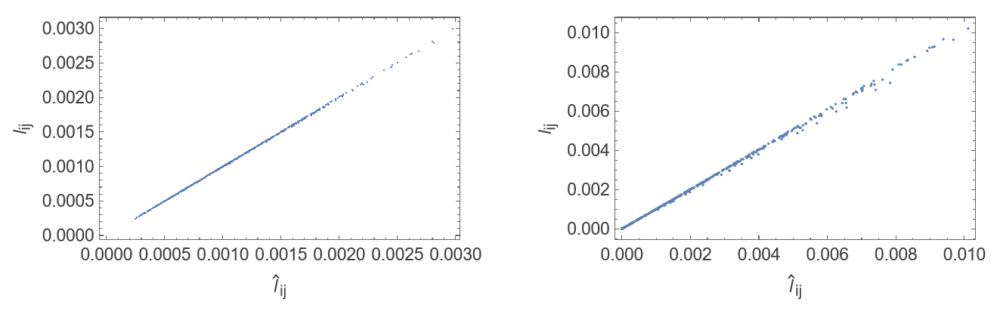
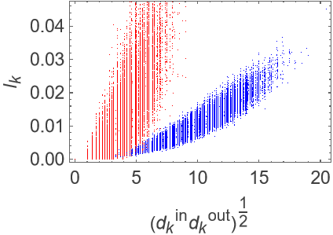
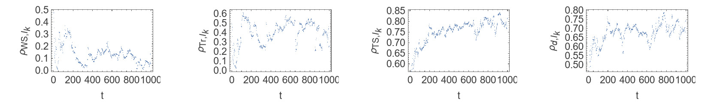
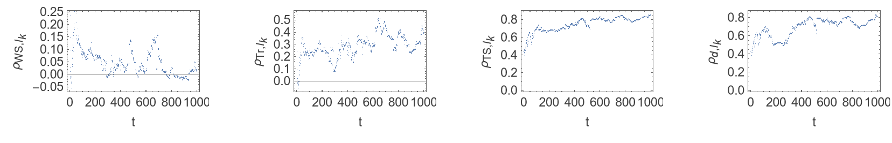

# Network Dynamics & Centrality Analysis

This project is a computational network analysis developed in **Wolfram Mathematica** during my Economics degree at University College London (UCL).

The project explores how network structure affects the importance of individual nodes and links. Networks are generated and represented as adjacency matrices, then analysed using simulation, linear algebra and statistical methods.

The analysis draws on the concept of **dynamical importance** developed by Restrepo, Ott and Hunt (2006), which measures the importance of a node or link through its effect on the largest eigenvalue of a network's adjacency matrix.

## What I Implemented

### Random Network Generation

I implemented functions for generating and analysing several types of networks, including:

- Erdős–Rényi random networks
- Spatial networks where connection probabilities depend on the geometric distance between nodes
- Assortative and disassortative networks
- A 20 × 20 square lattice
- A 20 × 20 toroidal lattice

Repeated simulations were used to investigate whether results were representative across different randomly generated networks and parameter values.

### Network Analysis

I implemented calculations for network properties including:

- Node degree
- Newman clustering coefficient
- Watts–Strogatz clustering coefficient
- Assortativity
- Eigenvalues and eigenvectors
- Node and link dynamical importance

Dynamical importance was calculated by removing a node or changing a link and measuring the resulting relative change in the largest eigenvalue of the adjacency matrix.

The computational results were also compared with theoretical approximations from Restrepo, Ott and Hunt (2006).

### Network Evolution Simulation

I developed an algorithm to simulate how a network changes over time.

At each time step, the algorithm:

1. Selects a node at random.
2. Removes its existing connections.
3. Calculates the degree of the remaining nodes.
4. Selects new neighbours probabilistically, with higher-degree nodes more likely to be selected.
5. Reconnects the selected node.
6. Stores the resulting network state.

The simulation was run for **1,000 time steps** and applied to both a square lattice and a toroidal lattice.

The evolving networks were then analysed to investigate relationships between dynamical importance, node degree, clustering, two-step paths and assortativity.

## Selected Results

### Theoretical Approximation of Link Dynamical Importance

Comparison of calculated link dynamical importance with the theoretical eigenvector-based approximation for two network structures.

### Network Structure and Node Dynamical Importance

Relationship between node dynamical importance and the geometric mean of in-degree and out-degree across repeated network simulations. The two network models exhibit noticeably different relationships between degree and dynamical importance.

### Evolution of the Square Lattice

Evolution over 1,000 simulation steps of the correlations between node dynamical importance and local clustering, triangle participation, two-step paths and node degree.

### Evolution of the Toroidal Lattice

The same correlation analysis applied to an initially toroidal network, allowing the effect of the network's starting topology to be compared with the square lattice.

## Computational Approach

The project uses adjacency matrices as the main representation of network structure and makes extensive use of matrix operations, random sampling and repeated simulation.

The implementation includes:

- Parameterised Wolfram Language functions
- Matrix and list manipulation
- Probabilistic network generation
- Iterative simulation
- Eigenvalue and eigenvector calculations
- Statistical correlation analysis
- Data visualisation

The implementation also avoids unnecessary repeated calculations in some computationally intensive operations. For example, the original network eigenvalue is calculated once and passed into repeated node and link perturbation calculations rather than being recalculated during every iteration.

## Technologies & Concepts

**Wolfram Mathematica / Wolfram Language** · Network Analysis · Simulation · Linear Algebra · Probability · Statistical Analysis · Data Visualisation

## Background

This project was originally completed as part of the **ECON0114** module during my Economics BSc at **University College London**.

I have included it in my programming portfolio as an example of my earlier use of programming for computational modelling, algorithmic problem solving and quantitative analysis.

## Viewing and Running the Project

The complete executable analysis is contained in
[`network-dynamics-analysis.nb`](network-dynamics-analysis.nb).

Because the Mathematica notebook is relatively large, GitHub may not render
it directly in the browser.

A PDF version of the complete analysis is also available:

**[View / download the full analysis (PDF)](network-dynamics-analysis.pdf)**

To run or modify the analysis, download `network-dynamics-analysis.nb` and
open it using Wolfram Mathematica.

## Reference

Restrepo, J. G., Ott, E. & Hunt, B. R. (2006). *Characterizing the Dynamical Importance of Network Nodes and Links*. Physical Review Letters.
